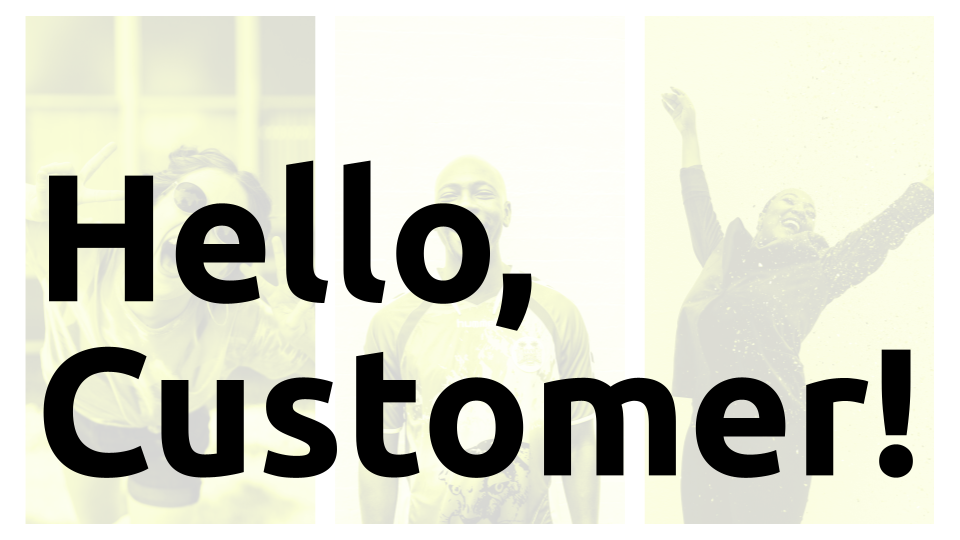
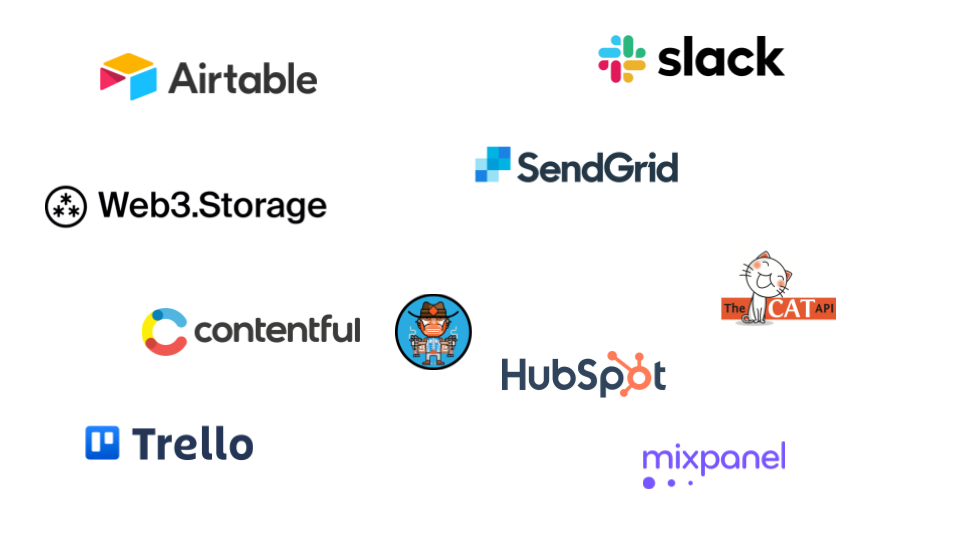
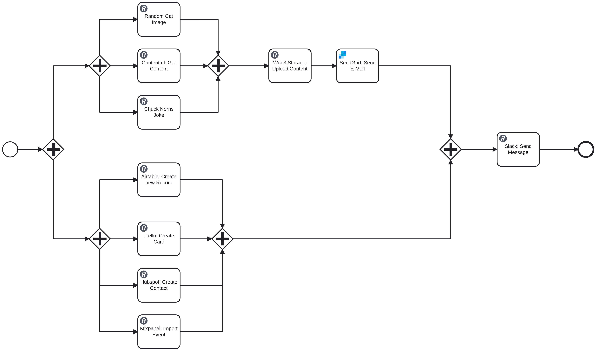
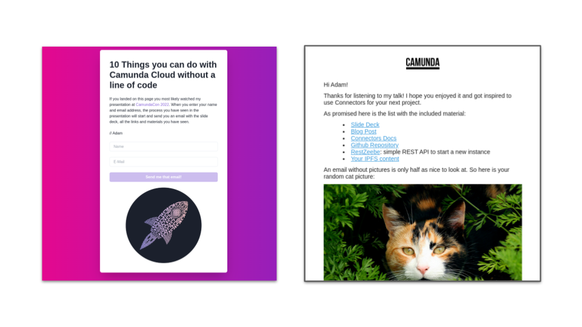
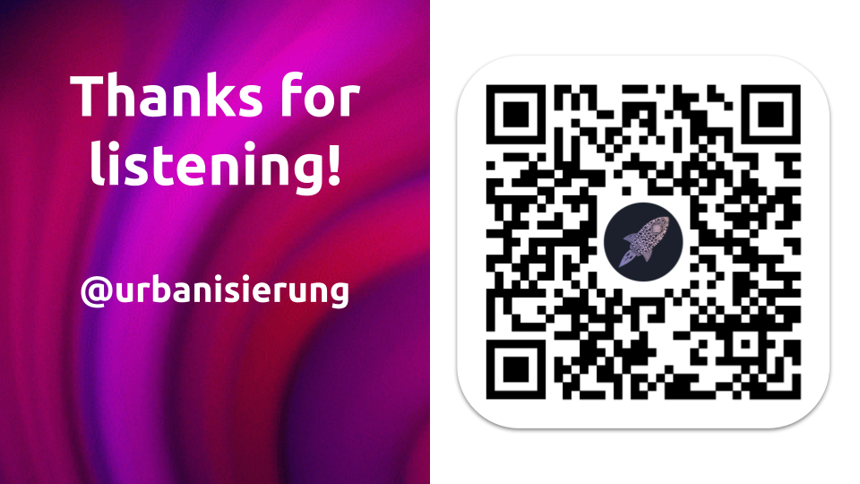

# Be an orchestration hero

Or: 10 Things you can do owith Camunda SaaS without a line of code

Everyone wants to have **satisfied customers and users**. A satisfied customer recommends your product or service, likes to give feedback and is also willing to spend money on it. The product itself is only half the truth. Whether a customer likes your product or not starts at the very first touch point.



So when we welcome a customer, for example, it's not just about writing a welcome email. It's about preparing a pleasant journey across all life cycles. A welcome email is only a small part of that.

We can do much more:

- we want to track that we have a new customer,
- we want to individualize content,
- we want to assign tasks so that a Customer Success Manager takes care of the customer.

Usually, none of these things is the core competency of your own product. It's more of a means to an end. And that's why we look at other products that have already solved this problem:

- we use Mixpanel to track events,
- we use Contentful to extract content,
- and we use Trello to create new tasks on a board.



## No line of code

If you are a developer, this won't make you sweat. But what if you don't have a developer background? Do you need to request resources from developers, or do you need to ask an agency that you can integrate with all the services? For my case described above, the answer is clearly **no**! I'm going to show you how you can easily integrate with 10 services without writing a single line of code using Camunda 8 and the recently introduced connectors.



That's the process I'm going to model in this article. The nice thing is that it is not a pure theoretical workflow, this workflow is deployed in Camunda SaaS and is started as soon as someone registers on the associated website with their email address. The workflow sends an email at the end with all necessary information, which I showed in my talk at [CamundaCon](https://camundacon.com) and decribed here.



## A little basic knowledge

If you already have experience with Camunda 8, then you know that a Service Worker is required to execute a Service Task. Camunda 8 Connectors make the custom development of service workers for certain use cases obsolete. So if you want to call a service with a RESTful API, you can use the generic REST Connector, which only needs to be configured. This includes things like the URL of the API, the request method, authorization, and parameters.


It's very easy to configure a task: just choose the associated connector instead of a service task. Currently there is a REST connector, a SendGrid connector and a Slack connector available.

To connect a service you have to do three things:

1. You usually need to have an account with the service provider.
2. You need to get the credentials for the API authentication.
3. You need to read the documentation of the service provider, so that you know which request you need to execute.

On Camunda's side, you will of course need a cluster, credentials in Secrets and the modeled diagram.


Secrets were introduced together with connectors. They are used to keep the keys for the APIs in a safe place. Thus, no credentials need to be stored in your BPMN diagram, but references are used. The creation is easily done via the cluster details in the Cloud Console.

## Ready, Steady, Go!

After we have discussed the basic technique it is (finally) time to start with the actual integration. To warm up, let's start with a few simple GET requests.

### A cat picture must not be missing

Our email should contain a cat picture. So that not every email contains the same cat we use The Cat API to get a random cat image. The following parameters are necessary:

- Task: REST Connector (No Auth)
- Request Method: GET
- URL: https://api.thecatapi.com/v1/images/search

The API provides us with an answer that looks like this:

```json
[
  {
    "id": "dmr",
    "url": "https://cdn2.thecatapi.com/images/dmr.jpg",
    "width": 640,
    "height": 512
  }
]
```

We are only interested in the URL, so we configure the following Result Expression:

```
{
  catImage: body[1].url
}
```

With this expression the URL from the response is stored in the variable `catImage` on the process context.

Note: FEEL is used for the expression. Note that the first element is addressed with index 1, not 0.

### Variable contents

The email contains various texts and links. To avoid having to constantly touch the email template when data changes, we use Contentful to store and read this data. This also has the advantage that this data can be used in other places. And we have a very natural separation between design and marketing copy.

- Task: REST Connector (Bearer Auth)
- Request Method: POST
- URL: https://graphql.contentful.com/content/v1/spaces/:spaceId
- Authentication: `secrets.CONTENTFUL` (Bearer Token you can get from the Contentful Console)

The content model in Contentful for this blog post consists of a single collection `email` with the attributes `id` (short text), `content` (short text) and `order` (integer).

The semantics behind the attributes are as follows:

- `id`: An internal identifier used to identify the entries.
- `content`: The actual content, be it text or a link.
- `order`: I made life a bit easy for myself and just want to execute one request against Contentful. By sorting by `order` I can target a specific entry.

Contentful provides a GraphQL API. With the following query I can read all entries from my collection:

```
{
  query: "{ emailCollection(order: [order_ASC]) { items { content } } }"
}
```

The response from Contentful will be stored on the process context with the following Result Expression:

```
{
  emailContent: {
    p1: body.data.emailCollection.items[1].content,
    p2: body.data.emailCollection.items[2].content,
    p3: body.data.emailCollection.items[3].content,
    p4: body.data.emailCollection.items[4].content,
    linkSlideDeck: body.data.emailCollection.items[5].content,
    linkGithub: body.data.emailCollection.items[6].content,
    linkBlog: body.data.emailCollection.items[7].content,
    linkApp: body.data.emailCollection.items[8].content
  }
}
```

### Something that lets you smile (hopefully)

Not all the content is loaded from Contentful. With another API I would like to make the recipient laugh and add a Chuck Norris joke. The World Wide Web wouldn't be the World Wide Web if there wasn't a service for everything: quickly found is the ChuckNorris API.

- Task: REST Connector (No Auth)
- Request Method: GET
- URL: https://api.chucknorris.io/jokes/random

I can specify in the request from which category the jokes should be randomly selected. For this I use the following expression as query parameter:

```
{
  category: "science"
}
```

I put the joke back on the process context so I can use it later in my email:

```
{
  chuckNorrisJoke: body.value
}
```

I think we're warmed up now: we've run the first requests, essentially to get data that we want to put into the final email. Next, we'll interact with services that run in the background and that a user doesn't directly notice.

### A new entry in an Airtable

I don't think I need to say much about Airtable itself. In this section we will create a new entry in a Base.

- Task: REST Connector (Bearer Auth)
- Request Method: POST
- URL: https://api.airtable.com/v0/:appId/:tableId
- Authentication: `secrets.AIRTABLE` (Bearer Token you can get from the Airtable App)

The table consists of the following columns: `name`, `email` and `status`. In a real world example, a team could work with Airtable and assess which support this user could best use to get the best onboarding. Using the API, multiple records can be added at once. For our example, we want to create exactly one new record and configure the following payload:

```
{
  records: [
    {
      fields: {
        Name: data.name,
        email: data.email,
        Status: "Todo"
      }
    }
  ]
}
```

Because we don't need the response on the process context, we also don't define a Result Expression, so we're done with our configuration of Airtable.

### Create a new Task in Trello

The Trello example has a similar background as the Airtable example just described. In the context of an onboarding, a task is to be created on a board so that an employee takes care of the user. This configuration is not complicated either:

- Task: REST Connector (No Auth)
- Request Method: POST
- URL: https://api.trello.com/1/cards

In doing so, I would like to add a new task on the board `ccon22`. The authentication works with the Trello API via query parameters, which look like this:

```
{
  key: "secrets.TRELLO_KEY",
  token: "secrets.TRELLO_TOKEN",
  idList: "62ff3b5d7651bd19ae07d45c",
  name: "Hi, "+data.name+"!"
}
```

Two hints at this point: You can also store `secrets` in query parameters, pay attention to the apostrophes, so that they are resolved correctly. Furthermore the API expects an ID for the list where the new task should be added. You can get this ID by appending a `.json` to the URL in the browser. You will see a JSON representation of the list and can pick the ID.

### Plan for Marketing E-Mails

The email we would like to send in the context of this article is a transactional mail. In the future, however, marketing emails may also be sent if a user has consented. For this we integrate Hubspot and create a new contact. In this way, marketing emails can be sent quite easily via Hubspot in the future.

- Task: REST Connector (Bearer Auth)
- Request Method: POST
- URL: https://api.hubapi.com/contacts/v1/contact/createOrUpdate/email/:email
- Authentication: `secrets.HUBSPOT` (Bearer Token you can get from the Hubspot Settings)

In this API request, the email is part of the URL. This can be implemented with a FEEL expression using the following expression:

```
"https://api.hubapi.com/contacts/v1/contact/createOrUpdate/email/"+data.email
```

In addition to the email address, the name should be added to the contact. Nothing simpler than that! We can add any (but existing) attributes as properties in the payload:

```
{
  properties: [
    {
      property: "firstname",
      value: data.name
    }
  ]
}
```

### Get metrics from the beginning

It's great when your product is perceived to be well received. But (subjective) impressions are not hard facts. For this reason, all relevant events should be tracked so that numbers are available to work with. This is what we will do now: When the onboarding process starts, a corresponding event is sent to Mixpanel. Finally, Mixpanel can be used to correlate, visualize, and evaluate the events with other events.

In Mixpanel we use the Import API, which allows authentication via Basic Auth. Other API requests expect the credentials in the payload, in which currently in Camunda SaaS no `secrets` can be resolved.

- Task: REST Connector (Basic Auth)
- Request Method: POST
- URL: https://api-eu.mixpanel.com/import
- Authentication: `"secrets.MIXPANEL_USERNAME"` and `"secrets.MIXPANEL_SECRET"`

The event payload looks as follows:

```
[
  {
    event: "ccon22",
    properties: {
      time: data.now,
      $insert_id: data.id,
      distinct_id: data.email,
      name: data.name
    }
  }
]
```

Wow, what a ride! We have already integrated seven services. But we're not at the end yet!

### Push data to the IPFS network

Blockchain, web3, crypto, there is no getting around these terms in the tech scene at the moment. We will also use decentralized infrastructure to make the relevant information available on the IPFS network. The content hash behind the data will be used to resolve the data on the associated website so that the info is not exclusively available in an email. Regular HTTP gateways also exist for web3 technologies. Using the API of Web3Storage we can easily upload data.

- Task: REST Connector (Bearer Auth)
- Request Method: POST
- URL: https://api.web3.storage/upload
- Authentication: `secrets.WEB3STORAGE`

We use the data we have already received from TheCatAPI, Contentful and the ChuckNorris API and create the following payload:

```
{
  content: {
    name: data.name,
    p1: emailContent.p1,
    p2: emailContent.p2,
    p3: emailContent.p3,
    p4: emailContent.p4,
    linkSlideDeck: emailContent.linkSlideDeck,
    linkGithub: emailContent.linkGithub,
    linkBlog: emailContent.linkBlog,
    chuckNorrisJoke: chuckNorrisJoke,
    cat: catImage
  }
}
```

We map the hash from the response back to a variable on the process context:

```
{
  ipfsHash: body.cid
}
```

The hash can be resolved via the gateway of `ipfs.io`, via `https://gateway.ipfs.io/ipfs/:hash`.

### It's time to send the email

By now we have given all the necessary requirements to send the email. We have a cat picture, a Chuck Norris joke, texts and links, and the recipient.

To send it, we use SendGrid. In SendGrid, it is easy to create a transactional template that contains variables. The variables are enriched by the payload (template data).

- Task: SendGrid Connector
- Authentication: `secrets.SENDGRID` (SendGrid Settings)
- Sender and Receiver
- Template Id
- Template Data

The template data is almost identical to that from the IPFS example. The only addition is that the IPFS hash is also passed as an attribute. The complete mapping are as follows:

```
{
  name: data.name,
  p1: emailContent.p1,
  p2: emailContent.p2,
  p3: emailContent.p3,
  p4: emailContent.p4,
  linkSlideDeck: emailContent.linkSlideDeck,
  linkGithub: emailContent.linkGithub,
  linkBlog: emailContent.linkBlog,
  linkApp: emailContent.linkApp,
  ipfsHash: ipfsHash,
  chuckNorrisJoke: chuckNorrisJoke,
  cat: catImage
}
```

### Notify the team

Not all employees in a company have access to all tools, and that's fine. It's not necessary for everyone to have access to all Hubspot contacts, or to see all Trello boards. Still, a new customer is information that is readily shared. It's hard to imagine companies without messengers. Usually, all employees of a company use the same messenger service. For this example, we'll send an event to a Slack channel to draw attention to a new user.

The prerequisite is that a Slack app exists and an incoming webhook is set up for a channel. The connector can be configured with the webhook URL:

- Task: REST Connector (No Auth)
- Request Method: POST
- URL: https://hooks.slack.com/services/:webhookid or `"secrets.SLACK"`

The payload can be used to set how the message should be displayed in Slack. We put together a fairly simple variant and send the following:

```
{
  blocks: [
    {
      type: "section",
      text: {
        type: "mrkdwn",
        text: "Welcome, "+data.name+"!"
      }
    }
  ]
}
```

We did it!!! 10 services integrated, not one line of code. One last step is missing: we need to merge all nodes.


The website I built as an input channel starts the process, which in turn goes through all the steps described.

I hope I could convince you that you can use Camunda SaaS without writing code. Connectors and Secrets provides the basis for this. Most services offer a RESTful API that can be integrated using the generic REST connector.


